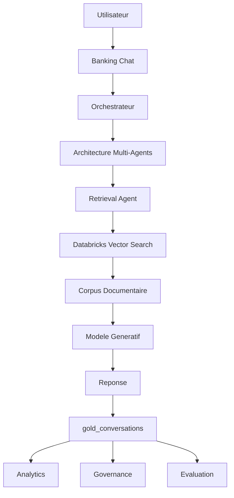

# AELON

> 🏦 Plateforme intelligente de service apres-vente bancaire, orientee Data Engineering, GenAI, RAG et Multi-Agents.

## Overview

AELON est une plateforme intelligente de service apres-vente bancaire developpee dans le cadre du projet RAISE. Elle combine Data Engineering, Intelligence Artificielle Generative, Retrieval-Augmented Generation (RAG) et Architecture Multi-Agents afin d'assister les utilisateurs bancaires, d'exploiter les conversations comme source d'aide a la decision et de superviser les performances des agents IA.

Concue comme une plateforme de capacites IA et data, AELON depasse le cadre d'un simple chatbot et structure un dispositif complet de recherche documentaire, generation de reponses, pilotage de qualite et valorisation analytique.

## Key Features

| Feature | Value |
|--------|-------|
|  - Banking Chat | Assistant bancaire conversationnel alimente par IA Generative et sources metier fiables. |
|  - Multi-Agent Architecture | Orchestration d'agents specialises pour retrieval, raisonnement, controle et supervision. |
|  - Databricks Lakehouse | Fondations data pour ingestion, transformation, historisation et exploitation analytique. |
|  - Databricks Vector Search | Recherche semantique par embeddings pour contextualiser les reponses. |
|  - Retrieval-Augmented Generation (RAG) | Reponses enrichies et ancrees sur un corpus documentaire bancaire. |
|  - Analytics Dashboard | Indicateurs sur volumes, categories et tendances conversationnelles. |
|  - Governance Dashboard | Suivi de la qualite, de l'usage des sources et monitoring des agents IA. |
|  - AI Evaluation Framework | Cadre de mesure des performances RAG et agents sur un dataset metier. |
|  - Conversation Analytics | Exploitation des conversations utilisateurs comme signal operationnel. |
|  - Decision Support | Production d'insights pour les equipes metier, data et gouvernance. |

## Architecture

### Architecture Globale

*Vue logique end-to-end du parcours utilisateur, de l'orchestration multi-agents et de la boucle Analytics/Governance/Evaluation.*

Cette architecture fait d'AELON un systeme bancaire intelligent bout en bout, ou chaque interaction utilisateur devient a la fois une assistance immediate et une source de pilotage pour l'amelioration continue.

## Medallion Architecture

Le pipeline documentaire AELON s'appuie sur une architecture medaillon pour garantir qualite, tracabilite et exploitation industrielle des donnees.

*Architecture medaillon orientee Lakehouse pour fiabiliser l'ingestion documentaire, la standardisation des donnees et l'alimentation RAG.*

### Bronze

- `bronze_documents`
- Role : ingestion des documents bruts, conservation des traces d'origine et reprise fiable des traitements.

### Silver

- `silver_documents`
- Role : nettoyage, normalisation et structuration des contenus documentaires pour les rendre exploitables.

### Gold

- `gold_documents`
- `gold_embeddings`
- `gold_conversations`
- Role : couche de consommation pour le RAG, la recherche vectorielle, l'analytics et la gouvernance.

## Tech Stack

| Domaine | Technologies |
|----------|-------------|
| Data Engineering | Databricks, PySpark, Delta Lake |
| AI | GenAI, RAG, Embeddings |
| Search | Databricks Vector Search |
| Governance | Unity Catalog |
| Backend | Python |
| Frontend | HTML, CSS, JavaScript |
| Analytics | Dashboards & KPI |

## Document Sources

Le corpus documentaire est construit a partir de sources de reference reglementaires et metier.

- Banque de France
- ACPR
- CNIL
- FBF
- FAQ metier

## Analytics & Governance

### Analytics Dashboard

Le dashboard Analytics fournit une vision claire de la dynamique conversationnelle.

*Exemple de dashboard Analytics pour suivre les volumes, tendances, categories et signaux metier issus des conversations.*

- volume de conversations
- categories
- tendances

### Governance Dashboard

Le dashboard Governance mesure la robustesse du systeme IA et la qualite des sorties.

- qualite des reponses
- utilisation des sources
- monitoring des agents

## Evaluation Framework

Le framework d'evaluation AELON permet de monitorer en continu la performance du systeme RAG et des agents IA sur des cas bancaires concrets.

### Dataset

- 36 questions metier

### Categories

- Fraude
- Carte bancaire
- Virement
- RGPD
- KYC
- Conformite

### KPIs

- Retrieval Success Rate
- Source Match Rate
- Category Match Rate
- Keyword Match Rate

### Resultats obtenus

| KPI | Valeur |
|-----|--------|
| Retrieval Success Rate | 100 % |
| Source Match Rate | 100 % |
| Category Coverage | 100 % |
| Keyword Match Rate | 62,5 % |
| Category Match Rate | 50 % |

Ces resultats valident la solidite du retrieval et de la couverture documentaire, tout en mettant en evidence des axes d'amelioration sur la precision semantique et la classification finale.

## Project Impact

AELON cree une valeur directe pour les operations bancaires et les equipes metier.

- assistance bancaire intelligente
- reduction du temps de recherche documentaire
- exploitation des conversations utilisateurs
- aide a la decision pour les equipes metier
- evaluation continue des agents IA

## Roadmap

Les prochaines etapes visent l'industrialisation et la maturite LLMOps de la plateforme.

- enrichissement documentaire
- feedback utilisateur
- guardrails IA
- deploiement industriel
- evaluation avancee des agents